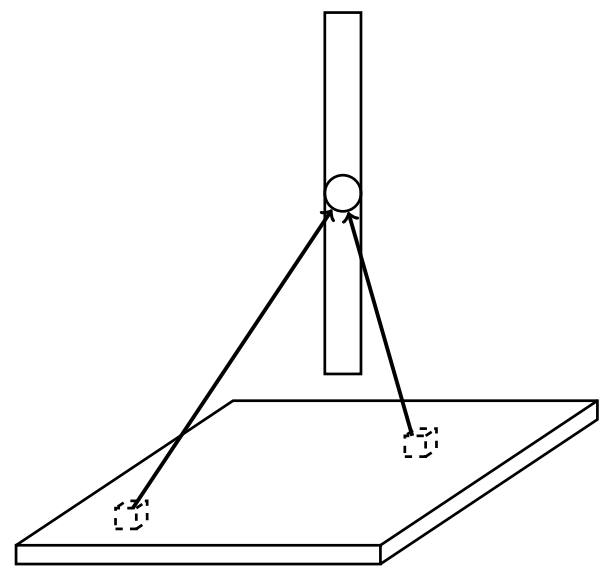
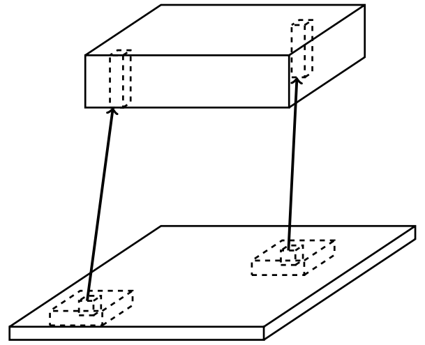
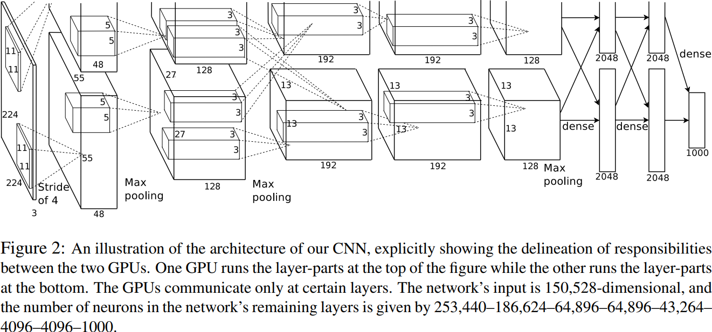
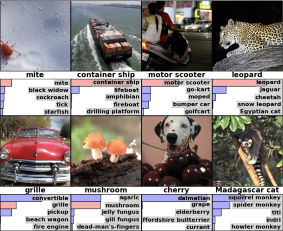
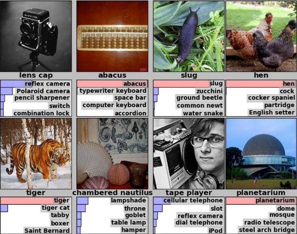

class: middle, center, title-slide

# Deep Learning

Lecture 3: Convolutional networks

  

.bold[Gilles Louppe] 
[g.louppe@uliege.be](mailto:g.louppe@uliege.be)

???

R: check https://github.com/m2dsupsdlclass/lectures-labs/blob/master/slides/04_conv_nets/index.html
R: check http://www.deeplearningindaba.com/uploads/1/0/2/6/102657286/indaba_convolutional.pdf
R: capsule networks to fix the issue of only detecting the presence of stuff. Capsules also detect their composition.

---

class: middle

# Convolutional networks

---

# Cooking recipe

- Get data (loads of them).
- Get good hardware.
- Define the neural network architecture as a composition of differentiable functions.
    - Stick to non-saturating activation function to avoid vanishing gradients.
    - Prefer deep over shallow architectures.
    - **In this lecture, we augment our set of differentiable functions with components tailored for spatial data (images, sequences, etc).**
- Optimize with (variants of) stochastic gradient descent.
    - Evaluate gradients with automatic differentiation.
---

# Motivation

Suppose we want to train a fully connected network that takes $200 \times 200$ RGB images as input.

.center.width-50[]

What are the problems with this first layer?
- Too many parameters: $200 \times 200 \times 3 \times 1000 = 120M$.
- What if the object in the image shifts a little?

---

# Fully connected layer

.center.width-40[]

In a **fully connected layer**, each hidden unit $h\_j = \sigma(\mathbf{w}\_j^T \mathbf{x}+b\_j)$ is connected to the entire image.
- Looking for activations that depend on pixels that are spatially far away is supposedly a waste of time and resources.
- Long range correlations can be dealt with in the higher layers.

---

# Locally connected layer

.center.width-40[]

In a **locally connected layer**, each hidden unit $h\_j$ is connected to only a patch of the image.
- Weights are specialized locally and functionally.
- Reduce the number of parameters.
- What if the object in the image shifts a little?

---

# Convolutional layer

.center.width-40[]

In a **convolutional layer**, each hidden unit $h\_j$ is connected
to only a patch of the image, and **share** its weights with the other units $h\_i$.
- Weights are specialized functionally, regardless of spatial location.
- Reduce the number of parameters.

---

# Convolution

For one-dimensional tensors, given an input vector $\mathbf{x} \in \mathbb{R}^W$ and a convolutional kernel $\mathbf{u} \in \mathbb{R}^w$,
the discrete **convolution** $\mathbf{x} \star \mathbf{u}$ is a vector of size $W - w + 1$ such that
$$\begin{aligned}
(\mathbf{x} \star \mathbf{u})\_i &= \sum\_{m=0}^{w-1} x\_{i+m} u\_m .
\end{aligned}
$$

Technically, $\star$ denotes the cross-correlation operator. However, most machine learning
libraries call it convolution.

---

class: middle

.center[]

.footnote[Credits: [Francois Fleuret, EE559 Deep Learning, EPFL, 2018.](https://documents.epfl.ch/users/f/fl/fleuret/www/dlc/dlc-slides-4a-dag-autograd-conv.pdf)]

---

Convolutions generalize to multi-dimensional tensors:
- In its most usual form, a convolution takes as input a 3D tensor $\mathbf{x} \in \mathbb{R}^{C \times H \times W}$, called the input feature map.
- A kernel $\mathbf{u} \in \mathbb{R}^{C \times h \times w}$ slides across the input feature map, along its height and width. The size $h \times w$ is called the receptive field.
- At each location,  the element-wise product between the kernel and the input elements it overlaps is computed and the results are summed up.

---

- The final output $\mathbf{o}$ is a 2D tensor of size $(H-h+1) \times (W-w+1)$ called the output feature map and such that:
$$\begin{aligned}
\mathbf{o}\_{j,i} &= \mathbf{b}\_{j,i} + \sum\_{c=0}^{C-1} (\mathbf{x}\_c \star \mathbf{u}\_c)\_{j,i} = \mathbf{b}\_{j,i} + \sum\_{c=0}^{C-1}  \sum\_{n=0}^{h-1} \sum\_{m=0}^{w-1}  \mathbf{x}\_{c,j+n,i+m} \mathbf{u}\_{c,n,m}
\end{aligned}$$
where $\mathbf{u}$ and $\mathbf{b}$ are shared parameters to learn.
- $D$ convolutions can be applied in the same way to produce a $D \times (H-h+1) \times (W-w+1)$ feature map,
where $D$ is the depth.
---

class: middle

.center[]

.footnote[Credits: [Francois Fleuret, EE559 Deep Learning, EPFL, 2018.](https://documents.epfl.ch/users/f/fl/fleuret/www/dlc/dlc-slides-4a-dag-autograd-conv.pdf)]

---

In addition to the depth $D$, the size of the output feature map can be controlled through the stride and with zero-padding.

- The stride $S$ specifies the size of the step the kernel slides with.
- Zero-padding specifies whether the input volume is pad with zeroes around the border.
  This makes it possible to produce an output volume of the same size as the input. A hyper-parameter $P$ controls the amount of padding.

---

class: middle

.grid.center[
.kol-1-6[]
.kol-1-3[]
.kol-1-3[]
]
.grid.center[
.kol-1-6[]
.kol-1-3[
No padding ($P=0$),  no strides ($S=1$).]
.kol-1-3[
Padding ($P=1$),  strides ($S=2$).]
]

---

# Equivariance

A function $f$ is **equivariant** to $g$ if $f(g(\mathbf{x})) = g(f(\mathbf{x}))$.
- Parameter sharing used in a convolutional layer causes the layer to be equivariant to translation.
- That is, if $g$ is any function that translates the input, the convolution function is equivariant to $g$.
    - E.g., if we move an object in the image, its representation will move the same amount in the output.
- This property is useful when we know some local function is useful everywhere (e.g., edge detectors).
- However, convolutions are not equivariant to other operations such as change in scale or rotation.

---

# Pooling

When the input volume is large, **pooling layers** can be used to reduce the input dimension while
preserving its global structure, in a way similar to a down-scaling operation.

Consider a pooling area of size $h \times w$ and a 3D input tensor $\mathbf{x} \in \mathbb{R}^{C\times(rh)\times(sw)}$.
- Max-pooling produces a tensor $\mathbf{o} \in \mathbb{R}^{C \times r \times s}$
such that
$$\mathbf{o}\_{c,j,i} = \max\_{n < h, m < w} \mathbf{x}_{c,rj+n,si+m}.$$
- Average pooling produces a tensor $\mathbf{o} \in \mathbb{R}^{C \times r \times s}$ such that
$$\mathbf{o}\_{c,j,i} = \frac{1}{hw} \sum\_{n=0}^{h-1} \sum\_{m=0}^{w-1} \mathbf{x}_{c,rj+n,si+m}.$$

Pooling is very similar in its formulation to convolution. Similarly, a pooling layer can be parameterized in terms of its receptive field, a stride $S$ and a zero-padding $P$.

---

class: middle

.center[]

.footnote[Credits: [Francois Fleuret, EE559 Deep Learning, EPFL, 2018.](https://documents.epfl.ch/users/f/fl/fleuret/www/dlc/dlc-slides-4a-dag-autograd-conv.pdf)]

---

# Invariance

A function $f$ is **invariant** to $g$ if $f(g(\mathbf{x})) = f(\mathbf{x})$.
- Pooling layers can be used for building inner activations that are (slightly) invariant to small translations of the input.
- Invariance to local translation is helpful if we care more about the presence of a pattern rather than its exact position.

---

# Layer patterns

A **convolutional network** can often be defined as a composition of convolutional layers ($\texttt{CONV}$), pooling layers ($\texttt{POOL}$), linear rectifiers ($\texttt{RELU}$) and fully connected layers ($\texttt{FC}$).

 
.center.width-90[]

---

The most common convolutional network architecture follows the pattern:

$$\texttt{INPUT} \to [[\texttt{CONV} \to \texttt{RELU}]\texttt{\*}N \to \texttt{POOL?}]\texttt{\*}M \to [\texttt{FC} \to \texttt{RELU}]\texttt{\*}K \to \texttt{FC}$$

where:
- $\texttt{\*}$ indicates repetition;
- $\texttt{POOL?}$ indicates an optional pooling layer;
- $N \geq 0$ (and usually $N \leq 3$), $M \geq 0$, $K \geq 0$ (and usually $K < 3$);
- the last fully connected layer holds the output (e.g., the class scores).

---

Some common architectures for convolutional networks following this pattern include:
- $\texttt{INPUT} \to \texttt{FC}$, which implements a linear classifier ($N=M=K=0$).
- $\texttt{INPUT} \to [\texttt{FC} \to \texttt{RELU}]{\*K} \to \texttt{FC}$, which implements a $K$-layer MLP.
- $\texttt{INPUT} \to \texttt{CONV} \to \texttt{RELU} \to \texttt{FC}$.
- $\texttt{INPUT} \to [\texttt{CONV} \to \texttt{RELU} \to \texttt{POOL}]\texttt{\*2} \to \texttt{FC} \to \texttt{RELU} \to \texttt{FC}$.
- $\texttt{INPUT} \to [[\texttt{CONV} \to \texttt{RELU}]\texttt{\*2} \to \texttt{POOL}]\texttt{\*3} \to [\texttt{FC} \to \texttt{RELU}]\texttt{\*2} \to \texttt{FC}$.

Note that for the last architecture, two $\texttt{CONV}$ layers are stacked before every $\texttt{POOL}$ layer. This is generally a good idea for larger and deeper networks, because multiple stacked $\texttt{CONV}$  layers can develop more complex features of the input volume before the destructive pooling operation.

---

class: center, middle

.width-100[]

---

# LeNet-1

.center[

<iframe width="640" height="480" src="https://www.youtube.com/embed/FwFduRA_L6Q?&loop=1&start=0" frameborder="0" volume="0" allowfullscreen></iframe>

]

.center[(LeCun et al, 1993)]

---

# LeNet-5

   

.center.width-100[]
.center[(LeCun et al, 1998)]

---

# AlexNet

  

.center.width-100[]
.center[(Krizhevsky et al, 2012)]

---

# GoogLeNet

    

.center.width-100[]
.center[(Szegedy et al, 2014)]

---

# VGGNet

  

.center.width-70[]
.center[(Simonyan and Zisserman, 2014)]

---

# ResNet

      

.center.width-100[]
.center[(He et al, 2015)]

---

# Object recognition

.grid[
.kol-1-2[]
.kol-1-2[]
]

The ImageNet challenge:
- $1000$ object classes
- $1200000$ training examples
- $100000$ test examples

---

class: middle

.center.width-100[]

---

class: middle

| &nbsp;&nbsp;&nbsp;Model | Size&nbsp;&nbsp;&nbsp; | Top-1 Accuracy&nbsp;&nbsp;&nbsp; | Top-5 Accuracy&nbsp;&nbsp;&nbsp; | Parameters&nbsp;&nbsp;&nbsp; | Depth&nbsp;&nbsp;&nbsp; |
| :----- | ----: | --------------: | --------------: | ----------: | -----: |
| Xception | 88 MB | 0.790 | 0.945| 22,910,480 | 126 |
| VGG16 | 528 MB| 0.715 | 0.901 | 138,357,544 | 23
| VGG19 | 549 MB | 0.727 | 0.910 | 143,667,240 | 26
| ResNet50 | 99 MB | 0.759 | 0.929 | 25,636,712 | 168
| InceptionV3 | 92 MB | 0.788 | 0.944 | 23,851,784 | 159 |
| InceptionResNetV2 | 215 MB | 0.804 | 0.953 | 55,873,736 | 572 |
| MobileNet | 17 MB | 0.665 | 0.871 | 4,253,864 | 88
| DenseNet121 | 33 MB | 0.745 | 0.918 | 8,062,504 | 121
| DenseNet169 | 57 MB | 0.759 | 0.928 | 14,307,880 | 169
| DenseNet201 | 80 MB | 0.770 | 0.933 | 20,242,984 | 201

.footnote[Credits: [Keras documentation](https://keras.io/applications/)]

---

# Maximum response samples

What does a convolutional network see?

Convolutional networks can be inspected by looking for input images $\mathbf{x}$ that maximize the activation $\mathbf{h}\_{\ell,d}(\mathbf{x})$ of a chosen convolutional kernel $\mathbf{u}$ at layer $\ell$ and index $d$ in the layer filter bank.

Such images can be found by gradient ascent on the input space:
$$\begin{aligned}
\mathcal{L}\_{\ell,d}(\mathbf{x}) &= ||\mathbf{h}\_{\ell,d}(\mathbf{x})||\_2\\\\
\mathbf{x}\_0 &\sim U[0,1]^{C \times H \times W } \\\\
\mathbf{x}\_{t+1} &= \mathbf{x}\_t + \gamma \nabla\_{\mathbf{x}} \mathcal{L}\_{\ell,d}(\mathbf{x}\_t)
\end{aligned}$$

---

class: middle

.width-100[]

.center[VGG16, convolutional layer 1-1, a few of the 64 filters]

.footnote[Credits: [How convolutional neural networks see the world](https://blog.keras.io/how-convolutional-neural-networks-see-the-world.html)]

---

class: middle

.width-100[]

.center[VGG16, convolutional layer 2-1, a few of the 128 filters]

.footnote[Credits: [How convolutional neural networks see the world](https://blog.keras.io/how-convolutional-neural-networks-see-the-world.html)]

---

class: middle

.width-100[]

.center[VGG16, convolutional layer 3-1, a few of the 256 filters]

.footnote[Credits: [How convolutional neural networks see the world](https://blog.keras.io/how-convolutional-neural-networks-see-the-world.html)]

---

class: middle

.width-100[]

.center[VGG16, convolutional layer 4-1, a few of the 512 filters]

.footnote[Credits: [How convolutional neural networks see the world](https://blog.keras.io/how-convolutional-neural-networks-see-the-world.html)]

---

class: middle

.width-100[]

.center[VGG16, convolutional layer 5-1, a few of the 512 filters]

.footnote[Credits: [How convolutional neural networks see the world](https://blog.keras.io/how-convolutional-neural-networks-see-the-world.html)]

---

Some observations:
- The first layers appear to encode direction and color.
- The direction and color filters get combined into grid and spot textures.
- These textures gradually get combined into increasingly complex patterns.

In other words, the network appears to learn a hierarchical composition of patterns.

 
.width-70.center[]

---

What if we build images that maximize the activation of a chosen class output?

  

.center[
.width-40[] .width-40[]
]

.center.italic[The left image is predicted with 99.9% confidence as a magpie.]

.footnote[Credits: [How convolutional neural networks see the world](https://blog.keras.io/how-convolutional-neural-networks-see-the-world.html)]

---

# Deep Dream

Start from an image $\mathbf{x}\_t$, offset the image by a random jitter, enhance some layer activation at multiple scales, zoom in, repeat on the produced image $\mathbf{x}\_{t+1}$.

.center[

<iframe width="600" height="400" src="https://www.youtube.com/embed/SCE-QeDfXtA?&loop=1&start=0" frameborder="0" volume="0" allowfullscreen></iframe>

]

---

class: end-slide, center
count: false

The end.

---

# References

- [CS231n Convolutional networks](https://cs231n.github.io/convolutional-networks/) (Fei-Fei Li et al, Stanford)
- [EE-559 Deep learning](https://documents.epfl.ch/users/f/fl/fleuret/www/dlc/) (Francois Fleuret, EPFL)

Further readings:
- [Feature Visualization](https://distill.pub/2017/feature-visualization/) (Olah et al, 2017)
- [The Building Blocks of Interpretability](https://distill.pub/2018/building-blocks/) (Olah et al, 2018)
