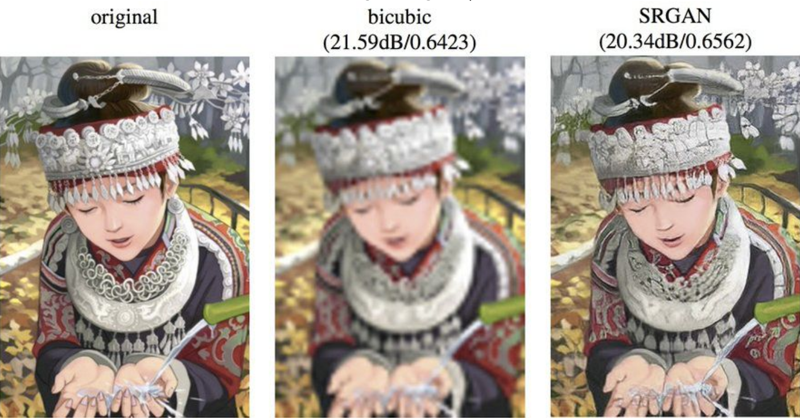
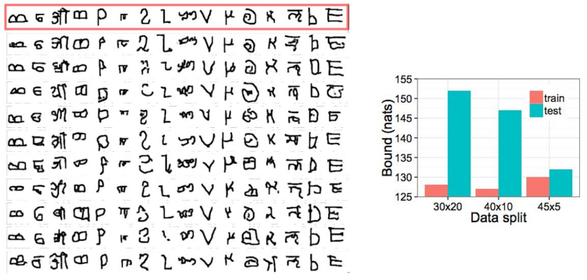
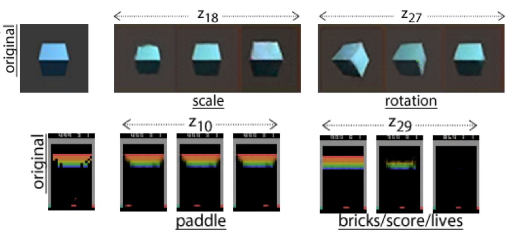
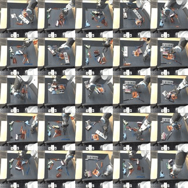
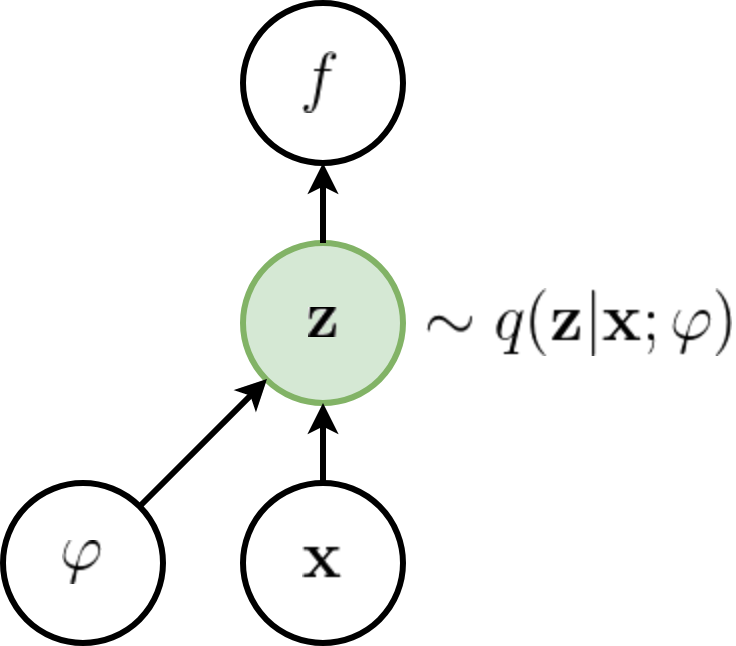
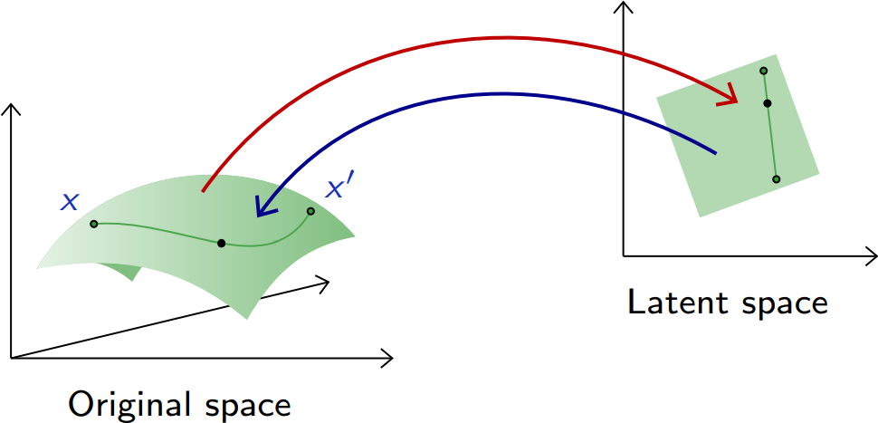
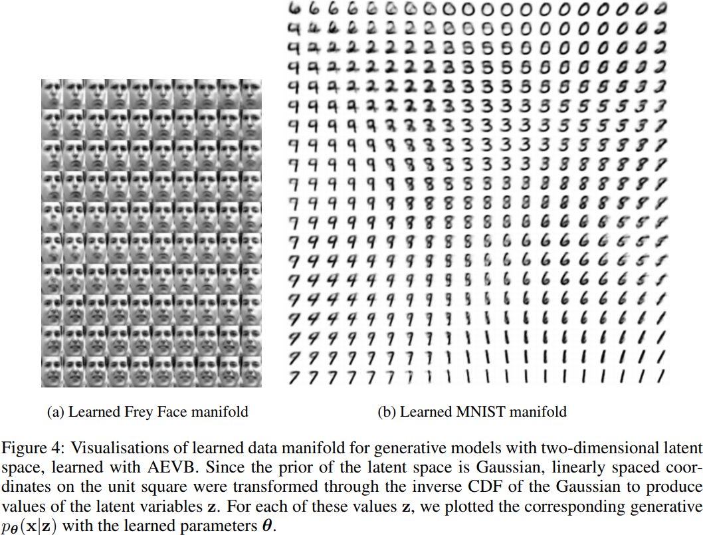
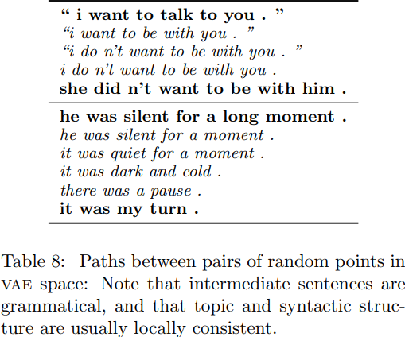

class: middle, center, title-slide

# Deep Learning

Lecture 4: Variational auto-encoders

  

.bold[Gilles Louppe] 
[g.louppe@uliege.be](mailto:g.louppe@uliege.be)

???

http://www.deeplearningindaba.com/uploads/1/0/2/6/102657286/deep_generative_models.pdf

---

# Outline

Goals: Learn models of the data itself.

- Generative models
- Variational inference
- Variational auto-encoders
- Generative adversarial networks (lecture 4)

---

class: middle

# Generative models

.italic[Slides adapted from "[Tutorial on Deep Generative Models](http://auai.org/uai2017/media/tutorials/shakir.pdf)" 
        (Shakir Mohamed and Danilo Rezende, UAI 2017).]

---

# Generative models

A generative model is a probabilistic model $p$ that can be used as **a simulator of the data**.
Its purpose is to generate synthetic but realistic high-dimension data
$$\mathbf{x} \sim p(\mathbf{x};\theta),$$
that is as close as possible from the true but unknown data distribution $p\_r(\mathbf{x})$.

Goals:
- Learn $p(\mathbf{x};\theta)$ (i.e., go beyond estimating $p(y|\mathbf{x})$).
- Understand and imagine how the world evolves.
- Recognize objects in the world and their factors of variation.
- Establish concepts for reasoning and decision making.

---

class: middle

.center[
.width-100[]
]
.center[Generative models have a role in many important problems]

---

# Drug design and response prediction

Generative models for proposing candidate molecules and for improving prediction through semi-supervised learning.

.center[
.width-100[]

(Gomez-Bombarelli et al, 2016)
]

---

# Locating celestial bodies

Generative models for applications in astronomy and high-energy physics.

.center[
.width-100[]

(Regier et al, 2015)
]

---

# Image super-resolution

Photo-realistic single image super-resolution.

.center[
.width-100[]

(Ledig et al, 2016)
]

---

# Text-to-speech synthesis

Generating audio conditioned on text.

.center[
.width-100[]

(Oord et al, 2016)
]

---

# Image and content generation

Generating images and video content.

.center[
.width-100[]

(Gregor et al, 2015; Oord et al, 2016; Dumoulin et al, 2016)
]

---

# Communication and compression

Hierarchical compression of images and other data.

.center[
.width-100[]

(Gregor et al, 2016)
]

---

# One-shot generalization

Rapid generalization of novel concepts.

.center[
.width-100[]

(Gregor et al, 2016)
]

---

# Visual concept learning

Understanding the factors of variation and invariances.

.center[
.width-100[]

(Higgins et al, 2017)
]

---

# Future simulation

Simulate future trajectories of environments based on actions for planning.

.center[
.width-40[] .width-40[]

(Finn et al, 2016)
]

---

# Scene understanding

Understanding the components of scenes and their interactions.

.center[
.width-100[]

(Wu et al, 2017)
]

---

class: middle

# Variational inference

---

# Latent variable model

.center.width-10[]

Consider for now a **prescribed latent variable model** that relates a set of observable variables $\mathbf{x} \in \mathcal{X}$ to a set of unobserved variables $\mathbf{z} \in \mathcal{Z}$.

This model is given and motivated by domain knowledge assumptions.

Examples:
- Linear discriminant analysis (see previous lecture)
- Bayesian networks
- Hidden Markov models
- Probabilistic programs

???

R: improve this

---

The probabilistic model defines a joint probability distribution $p(\mathbf{x}, \mathbf{z})$, which decomposes as
$$p(\mathbf{x}, \mathbf{z}) = p(\mathbf{x}|\mathbf{z}) p(\mathbf{z}).$$
If we interpret $\mathbf{z}$ as causal factors for the high-dimension representations $\mathbf{x}$, then
sampling from $p(\mathbf{x}|\mathbf{z})$ can be interpreted as **a stochastic generating process** from $\mathcal{Z}$ to $\mathcal{X}$.

For a given model $p(\mathbf{x}, \mathbf{z})$, inference consists in computing the posterior
$$p(\mathbf{z}|\mathbf{x}) = \frac{p(\mathbf{x}|\mathbf{z}) p(\mathbf{z})}{p(\mathbf{x})}.$$

For most interesting cases, this is usually intractable since it requires evaluating the evidence
$$p(\mathbf{x}) = \int p(\mathbf{x}|\mathbf{z})p(\mathbf{z}) d\mathbf{z}.$$

---

class: middle

.center.width-70[]

.footnote[Credits: [Francois Fleuret, EE559 Deep Learning, EPFL, 2018.](https://documents.epfl.ch/users/f/fl/fleuret/www/dlc/dlc-slides-9-autoencoders.pdf)]

---

# Variational inference

**Variational inference** turns posterior inference into an optimization problem.

Consider a family of distributions $q(\mathbf{z}|\mathbf{x}; \nu)$ that approximate the posterior $p(\mathbf{z}|\mathbf{x})$, where the
variational parameters $\nu$ index the family of distributions.

The parameters $\nu$ are fit to minimize the KL divergence between $p(\mathbf{z}|\mathbf{x})$ and the approximation $q(\mathbf{z}|\mathbf{x};\nu)$:
$$\begin{aligned}
KL(q\(\mathbf{z}|\mathbf{x};\nu) || p(\mathbf{z}|\mathbf{x})) &= \mathbb{E}\_{q(\mathbf{z}|\mathbf{x};\nu)}\left[\log \frac{q(\mathbf{z}|\mathbf{x} ; \nu)}{p(\mathbf{z}|\mathbf{x})}\right] \\\\
&= \mathbb{E}\_{q(\mathbf{z}|\mathbf{x};\nu)}\left[ \log q(\mathbf{z}|\mathbf{x};\nu) - \log p(\mathbf{x},\mathbf{z}) \right] + \log p(\mathbf{x})
\end{aligned}$$
For the same reason as before, the KL divergence cannot be directly minimized because
of the $\log p(\mathbf{x})$ term.

---

However, we can write
$$
\log p(\mathbf{x}) = \underbrace{\mathbb{E}\_{q(\mathbf{z}|\mathbf{x};\nu)}\left[ \log p(\mathbf{x},\mathbf{z}) - \log q(\mathbf{z}|\mathbf{x};\nu) \right]}\_{\text{ELBO}(\mathbf{x};\nu)} + KL(q(\mathbf{z}|\mathbf{x};\nu) || p(\mathbf{z}|\mathbf{x})),
$$
where $\text{ELBO}(\mathbf{x};\nu)$ is called the **evidence lower bound objective**.

Since $\log p(\mathbf{x})$ does not depend on $\nu$, it can be considered as a constant, and minimizing the KL divergence is equivalent to maximizing the evidence lower bound, while being computationally tractable.

Finally, given a dataset $\mathbf{d} = \\\{\mathbf{x}\_i|i=1, ..., N\\\}$, the final objective is the sum $\sum\_{\\\{\mathbf{x}\_i \in \mathbf{d}\\\}} \text{ELBO}(\mathbf{x}\_i;\nu)$.

---

Remark that
$$\begin{aligned}
\text{ELBO}(\mathbf{x};\nu) &= \mathbb{E}\_{q(\mathbf{z};|\mathbf{x}\nu)}\left[ \log p(\mathbf{x},\mathbf{z}) - \log q(\mathbf{z}|\mathbf{x};\nu) \right] \\\\
&= \mathbb{E}\_{q(\mathbf{z}|\mathbf{x};\nu)}\left[ \log p(\mathbf{x}|\mathbf{z}) p(\mathbf{z}) - \log q(\mathbf{z}|\mathbf{x};\nu) \right] \\\\
&= \mathbb{E}\_{q(\mathbf{z}|\mathbf{x};\nu)}\left[ \log p(\mathbf{x}|\mathbf{z})\right] - KL(q(\mathbf{z}|\mathbf{x};\nu) || p(\mathbf{z}))
\end{aligned}$$
Therefore, maximizing the ELBO:
- encourages distributions to place their mass on configurations of latent variables that explain the observed data (first term);
- encourages distributions close to the prior (second term).

---

class: middle, center

.width-100[]

Variational inference

---

How do we optimize the parameters $\nu$? We want

$$\begin{aligned}
\nu^{\*} &= \arg \max\_\nu \text{ELBO}(\mathbf{x};\nu) \\\\
&= \arg \max\_\nu \mathbb{E}\_{q(\mathbf{z}|\mathbf{x};\nu)}\left[ \log p(\mathbf{x},\mathbf{z}) - \log q(\mathbf{z}|\mathbf{x};\nu) \right]
\end{aligned}$$

We can proceed by gradient ascent, provided we can evaluate $\nabla\_\nu \text{ELBO}(\mathbf{x};\nu)$.

In general,
this gradient is difficult to compute because the expectation is unknown and the parameters $\nu$,
with respect to which we compute the gradient, are of the distribution $q(\mathbf{z}|\mathbf{x};\nu)$ we integrate over.

Solutions:
- Score function estimators:
$$\nabla\_\nu \text{ELBO}(\mathbf{x};\nu) = \mathbb{E}\_{q(\mathbf{z}|\mathbf{x};\nu)} \left[ \nabla\_\nu \log q(\mathbf{z}|\mathbf{x};\nu) \left( \log p(\mathbf{x},\mathbf{z}) - \log q(\mathbf{z}|\mathbf{x};\nu) \right)\right]$$
- Elliptical standardization (Kucukelbir et al, 2016).

---

class: middle

# Variational auto-encoders

---

# Variational auto-encoders

So far we assumed a prescribed probabilistic model motivated by domain knowledge.
We will now directly learn a stochastic generating process with a neural network.

A variational auto-encoder is a deep latent variable model where:
- The likelihood $p(\mathbf{x}|\mathbf{z};\theta)$ is parameterized with a **generative network** $\text{NN}\_\theta$
(or decoder) that takes as input $\mathbf{z}$ and outputs parameters $\phi = \text{NN}\_\theta(\mathbf{z})$ to the data distribution. E.g.,
$$\begin{aligned}
\mu, \sigma &= \text{NN}\_\theta(\mathbf{z}) \\\\
p(\mathbf{x}|\mathbf{z};\theta) &= \mathcal{N}(\mathbf{x}; \mu, \sigma^2\mathbf{I})
\end{aligned}$$
- The approximate posterior $q(\mathbf{z}|\mathbf{x};\varphi)$ is parameterized
with an **inference network** $\text{NN}\_\varphi$ (or encoder) that takes as input $\mathbf{x}$ and
outputs parameters $\nu = \text{NN}\_\varphi(\mathbf{x})$ to the approximate posterior. E.g.,
$$\begin{aligned}
\mu, \sigma &= \text{NN}\_\varphi(\mathbf{x}) \\\\
q(\mathbf{z}|\mathbf{x};\varphi) &= \mathcal{N}(\mathbf{z}; \mu, \sigma^2\mathbf{I})
\end{aligned}$$

---

class: middle

.center.width-70[]

.footnote[Credits: [Francois Fleuret, EE559 Deep Learning, EPFL, 2018.](https://documents.epfl.ch/users/f/fl/fleuret/www/dlc/dlc-slides-9-autoencoders.pdf)]

---

As before, we can use variational inference, but to jointly optimize the generative and the inference networks parameters $\theta$ and $\varphi$.

We want:
$$\begin{aligned}
\theta^{\*}, \varphi^{\*} &= \arg \max\_{\theta,\varphi} \text{ELBO}(\mathbf{x};\theta,\varphi) \\\\
&= \arg \max\_{\theta,\varphi} \mathbb{E}\_{q(\mathbf{z}|\mathbf{x};\varphi)}\left[ \log p(\mathbf{x},\mathbf{z};\theta) - \log q(\mathbf{z}|\mathbf{x};\varphi)\right] \\\\
&= \arg \max\_{\theta,\varphi} \mathbb{E}\_{q(\mathbf{z}|\mathbf{x};\varphi)}\left[ \log p(\mathbf{x}|\mathbf{z};\theta)\right] - KL(q(\mathbf{z}|\mathbf{x};\varphi) || p(\mathbf{z}))
\end{aligned}$$

- Given some generative network $\theta$, we want to put the mass of the latent variables, by adjusting $\varphi$, such that they explain the observed data, while remaining close to the prior.
- Given some inference network $\varphi$, we want to put the mass of the observed variables, by adjusting $\theta$, such that
they are well explained by the latent variables.

---

Unbiased gradients of the ELBO with respect to the generative model parameters $\theta$ are simple to obtain:
$$\begin{aligned}
\nabla\_\theta \text{ELBO}(\mathbf{x};\theta,\varphi) &= \nabla\_\theta \mathbb{E}\_{q(\mathbf{z}|\mathbf{x};\varphi)}\left[ \log p(\mathbf{x},\mathbf{z};\theta) - \log q(\mathbf{z}|\mathbf{x};\varphi)\right] \\\\
&= \mathbb{E}\_{q(\mathbf{z}|\mathbf{x};\varphi)}\left[ \nabla\_\theta ( \log p(\mathbf{x},\mathbf{z};\theta) - \log q(\mathbf{z}|\mathbf{x};\varphi) ) \right] \\\\
&= \mathbb{E}\_{q(\mathbf{z}|\mathbf{x};\varphi)}\left[ \nabla\_\theta \log p(\mathbf{x},\mathbf{z};\theta) \right],
\end{aligned}$$
which can be estimated with Monte Carlo integration.

However, gradients with respect to the inference model parameters $\varphi$ are
more difficult to obtain:
$$\begin{aligned}
\nabla\_\varphi \text{ELBO}(\mathbf{x};\theta,\varphi) &= \nabla\_\varphi \mathbb{E}\_{q(\mathbf{z}|\mathbf{x};\varphi)}\left[ \log p(\mathbf{x},\mathbf{z};\theta) - \log q(\mathbf{z}|\mathbf{x};\varphi)\right] \\\\
&\neq \mathbb{E}\_{q(\mathbf{z}|\mathbf{x};\varphi)}\left[ \nabla\_\varphi ( \log p(\mathbf{x},\mathbf{z};\theta) - \log q(\mathbf{z}|\mathbf{x};\varphi) ) \right]
\end{aligned}$$

---

Let us abbreviate
$$\begin{aligned}
\text{ELBO}(\mathbf{x};\theta,\varphi) &= \mathbb{E}\_{q(\mathbf{z}|\mathbf{x};\varphi)}\left[ \log p(\mathbf{x},\mathbf{z};\theta) - \log q(\mathbf{z}|\mathbf{x};\varphi)\right] \\\\
&= \mathbb{E}\_{q(\mathbf{z}|\mathbf{x};\varphi)}\left[ f(\mathbf{x}, \mathbf{z}; \varphi) \right].
\end{aligned}$$

We have
.center.width-50[]

We cannot backpropagate through the stochastic node $\mathbf{z}$ to compute $\nabla\_\varphi f$.

---

# Reparameterization trick

The **reparameterization trick** consists in re-expressing the variable $\mathbf{z} \sim q(\mathbf{z}|\mathbf{x};\varphi)$ as some differentiable and invertible transformation
of another random variable $\epsilon$, given $\mathbf{x}$ and $\varphi$,
$$\mathbf{z} = g(\varphi, \mathbf{x}, \epsilon),$$
and where the distribution of $\epsilon$ is independent of $\mathbf{x}$ or $\varphi$.

For example, if $q(\mathbf{z}|\mathbf{x};\varphi) = \mathcal{N}(\mathbf{z}; \mu(\mathbf{x};\varphi), \sigma^2(\mathbf{x};\varphi))$, where $\mu(\mathbf{x};\varphi)$ and $\sigma^2(\mathbf{x};\varphi)$
are the outputs of the inference network $NN\_\varphi$, then a common reparameterization is:
$$\begin{aligned}
p(\epsilon) &= \mathcal{N}(\epsilon; \mathbf{0}, \mathbf{I}) \\\\
\mathbf{z} &= \mu(\mathbf{x};\varphi) + \sigma(\mathbf{x};\varphi) \odot \epsilon
\end{aligned}$$

---

class: middle

.center.width-60[]

---

Given such a change of variable, the ELBO can be rewritten as:
$$\begin{aligned}
\text{ELBO}(\mathbf{x};\theta,\varphi) &= \mathbb{E}\_{q(\mathbf{z}|\mathbf{x};\varphi)}\left[ f(\mathbf{x}, \mathbf{z}; \varphi) \right]\\\\
&= \mathbb{E}\_{p(\epsilon)} \left[ f(\mathbf{x}, g(\varphi,\mathbf{x},\epsilon); \varphi) \right]
\end{aligned}$$
Therefore,
$$\begin{aligned}
\nabla\_\varphi \text{ELBO}(\mathbf{x};\theta,\varphi) &= \nabla\_\varphi \mathbb{E}\_{p(\epsilon)} \left[  f(\mathbf{x}, g(\varphi,\mathbf{x},\epsilon); \varphi) \right] \\\\
&= \mathbb{E}\_{p(\epsilon)} \left[ \nabla\_\varphi  f(\mathbf{x}, g(\varphi,\mathbf{x},\epsilon); \varphi) \right],
\end{aligned}$$
which we can now estimate with Monte Carlo integration.

The last required ingredient is the evaluation of the likelihood $q(\mathbf{z}|\mathbf{x};\varphi)$ given the change of variable $g$. As long as $g$ is invertible, we have:
$$\log q(\mathbf{z}|\mathbf{x};\varphi) = \log p(\epsilon) - \log \left| \det\left( \frac{\partial \mathbf{z}}{\partial \epsilon} \right) \right|$$

---

# Example

Consider the following setup:
- Generative model:
$$\begin{aligned}
\mathbf{z} &\in \mathbb{R}^J \\\\
p(\mathbf{z}) &= \mathcal{N}(\mathbf{z}; \mathbf{0},\mathbf{I})\\\\
p(\mathbf{x}|\mathbf{z};\theta) &= \mathcal{N}(\mathbf{x};\mu(\mathbf{z};\theta), \sigma^2(\mathbf{z};\theta)\mathbf{I}) \\\\
\mu(\mathbf{z};\theta) &= \mathbf{W}\_2^T\mathbf{h} + \mathbf{b}\_2 \\\\
\log \sigma^2(\mathbf{z};\theta) &= \mathbf{W}\_3^T\mathbf{h} + \mathbf{b}\_3 \\\\
\mathbf{h} &= \text{ReLU}(\mathbf{W}\_1^T \mathbf{z} + \mathbf{b}\_1)\\\\
\theta &= \\\{ \mathbf{W}\_1, \mathbf{b}\_1, \mathbf{W}\_2, \mathbf{b}\_2, \mathbf{W}\_3, \mathbf{b}\_3 \\\}
\end{aligned}$$

---

- Inference model:
$$\begin{aligned}
q(\mathbf{z}|\mathbf{x};\varphi) &=  \mathcal{N}(\mathbf{z};\mu(\mathbf{x};\varphi), \sigma^2(\mathbf{x};\varphi)\mathbf{I}) \\\\
p(\epsilon) &= \mathcal{N}(\epsilon; \mathbf{0}, \mathbf{I}) \\\\
\mathbf{z} &= \mu(\mathbf{x};\varphi) + \sigma(\mathbf{x};\varphi) \odot \epsilon \\\\
\mu(\mathbf{x};\varphi) &= \mathbf{W}\_5^T\mathbf{h} + \mathbf{b}\_5 \\\\
\log \sigma^2(\mathbf{x};\varphi) &= \mathbf{W}\_6^T\mathbf{h} + \mathbf{b}\_6 \\\\
\mathbf{h} &= \text{ReLU}(\mathbf{W}\_4^T \mathbf{x} + \mathbf{b}\_4)\\\\
\varphi &= \\\{ \mathbf{W}\_4, \mathbf{b}\_4, \mathbf{W}\_5, \mathbf{b}\_5, \mathbf{W}\_6, \mathbf{b}\_6 \\\}
\end{aligned}$$

Note that there is no restriction on the generative and inference network architectures.
They could as well be arbitrarily complex convolutional networks.

---

Plugging everything together, the objective can be expressed as:
$$\begin{aligned}
\text{ELBO}(\mathbf{x};\theta,\varphi) &= \mathbb{E}\_{q(\mathbf{z}|\mathbf{x};\varphi)}\left[ \log p(\mathbf{x},\mathbf{z};\theta) - \log q(\mathbf{z}|\mathbf{x};\varphi)\right] \\\\
&= \mathbb{E}\_{q(\mathbf{z}|\mathbf{x};\varphi)} \left[ \log p(\mathbf{x}|\mathbf{z};\theta) \right] - KL(q(\mathbf{z}|\mathbf{x};\varphi) || p(\mathbf{z})) \\\\
&= \mathbb{E}\_{p(\epsilon)} \left[  \log p(\mathbf{x}|\mathbf{z}=g(\varphi,\mathbf{x},\epsilon);\theta) \right] - KL(q(\mathbf{z}|\mathbf{x};\varphi) || p(\mathbf{z}))
\end{aligned}
$$
where the KL divergence can be expressed  analytically as
$$KL(q(\mathbf{z}|\mathbf{x};\varphi) || p(\mathbf{z})) = \frac{1}{2} \sum\_{j=1}^J \left( 1 + \log(\sigma\_j^2(\mathbf{x};\varphi)) - \mu\_j^2(\mathbf{x};\varphi) - \sigma\_j^2(\mathbf{x};\varphi)\right),$$
which allows to evaluate its derivative without approximation.

---

class: middle

Consider as data $\mathbf{d}$ the MNIST digit dataset:

.center.width-100[]

---

class: middle, center

.width-100[]

(Kingma and Welling, 2013)

---

class: middle

To get an intuition of the learned latent representation, we can pick two samples $\mathbf{x}$ and $\mathbf{x}'$ at random and interpolate samples along the line in the latent space.

.center.width-70[]

.footnote[Credits: [Francois Fleuret, EE559 Deep Learning, EPFL, 2018.](https://documents.epfl.ch/users/f/fl/fleuret/www/dlc/dlc-slides-9-autoencoders.pdf)]

---

class: middle, center

.width-100[]

(Kingma and Welling, 2013)

---

# Some further examples

.center[

<iframe width="640" height="480" src="https://www.youtube.com/embed/XNZIN7Jh3Sg?&loop=1&start=0" frameborder="0" volume="0" allowfullscreen></iframe>

Random walks in latent space.

]

---

class: middle

.center.width-80[]

.center[(White, 2016)]

---

class: middle

.center.width-60[]

.center[(Bowman et al, 2015)]

---

class: middle

.center[

<iframe width="320" height="240" src="https://int8.io/wp-content/uploads/2016/12/output.mp4" frameborder="0" volume="0" allowfullscreen></iframe>

Impersonation by encoding-decoding an unknown face.
]

---

class: middle

.center.width-100[]

.center[Design of new molecules with desired chemical properties.  (Gomez-Bombarelli et al, 2016)]

---

class: middle

# References

---

# References

- [Tutorial on Deep Generative Models](http://auai.org/uai2017/media/tutorials/shakir.pdf) (Mohamed and Rezende, UAI 2017)
- [Variational inference: Foundations and modern methods](https://media.nips.cc/Conferences/2016/Slides/6199-Slides.pdf) (Blei et al, 2016)
- [Auto-Encoding Variational Bayes](https://arxiv.org/pdf/1312.6114.pdf) (Kingma and Welling, 2013)

---

# Quiz

- Explain how variational inference could be used for Bayesian inference.
- What is the reparameterization trick?
- What are generative models used for?
